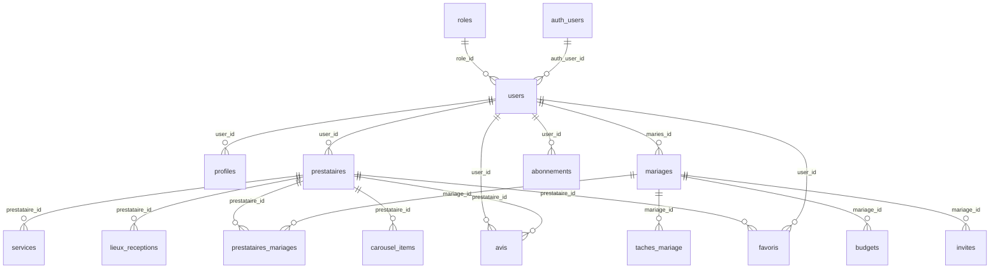

# 📊 Schéma de Base de Données - Arooskena

## 🔗 Vue d'ensemble des relations



## 📋 Tables principales

### 🔐 `auth.users` (Supabase Auth)
Table gérée automatiquement par Supabase Auth.

**Champs :**
- `id` (uuid) - Identifiant unique de l'utilisateur authentifié
- `email` (text) - Email de l'utilisateur
- `created_at` (timestampz) - Date de création
- `updated_at` (timestampz) - Date de mise à jour

### 👥 `users`
Extension de `auth.users` avec les données métier.

**Champs :**
- `id` (uuid) - Identifiant interne de la plateforme
- `auth_user_id` (uuid) - Référence vers `auth.users.id` (Supabase Auth)
- `email` (text) - Email de l'utilisateur
- `phone` (text) - Numéro de téléphone
- `role_id` (uuid) - Référence vers `roles.id`
- `is_active` (boolean) - Statut actif/inactif
- `created_at` (timestampz) - Date de création
- `updated_at` (timestampz) - Date de mise à jour

**Relations :**
- `auth_user_id` → `auth.users.id`
- `role_id` → `roles.id`

**⚠️ Important :** 
- `users.id` est l'identifiant interne de la plateforme
- `auth_user_id` référence l'utilisateur authentifié dans Supabase Auth
- Toutes les requêtes frontend doivent utiliser `auth_user_id` pour l'authentification

### 🏷️ `roles`
Définition des rôles disponibles dans la plateforme.

**Champs :**
- `id` (uuid) - Identifiant unique
- `name` (text) - Identifiant technique (ex: 'couple', 'prestataire')
- `label` (text) - Nom affiché (ex: 'Couple', 'Prestataire')
- `description` (text) - Description du rôle
- `created_at` (timestampz) - Date de création

**Rôles par défaut :**
- `couple` - Couple organisant son mariage
- `prestataire` - Professionnel proposant des services
- `admin` - Administrateur de la plateforme

### 👤 `profiles`
Informations personnelles et visuelles de l'utilisateur.

**Champs :**
- `id` (uuid) - Identifiant du profil
- `user_id` (uuid) - Référence vers `users.id`
- `first_name` (text) - Prénom
- `last_name` (text) - Nom de famille
- `avatar` (text) - URL de l'avatar
- `slug` (text) - Identifiant public unique
- `bio` (text) - Biographie
- `website` (text) - Site web
- `location` (text) - Localisation
- `created_at` (timestampz) - Date de création
- `updated_at` (timestampz) - Date de mise à jour

**Relations :**
- `user_id` → `users.id`

### 🏢 `prestataires`
Professionnels proposant des services de mariage.

**Champs :**
- `id` (uuid) - Identifiant unique
- `user_id` (uuid) - Référence vers `users.id`
- `nom_entreprise` (text) - Nom de l'entreprise
- `description` (text) - Description des services
- `categorie` (text) - Catégorie de service
- `adresse` (text) - Adresse
- `telephone` (text) - Téléphone
- `email` (text) - Email
- `website` (text) - Site web
- `prix_min` (decimal) - Prix minimum
- `prix_max` (decimal) - Prix maximum
- `devise` (text) - Devise (EUR par défaut)
- `images` (text[]) - URLs des images
- `is_verified` (boolean) - Statut vérifié
- `is_featured` (boolean) - Mise en avant
- `subscription_type` (text) - Type d'abonnement
- `created_at` (timestampz) - Date de création
- `updated_at` (timestampz) - Date de mise à jour

**Relations :**
- `user_id` → `users.id`

### 💒 `mariages`
Projets de mariage des couples.

**Champs :**
- `id` (uuid) - Identifiant unique
- `maries_id` (uuid) - Référence vers `users.id` (le couple)
- `nom_mariage` (text) - Nom du mariage
- `date_mariage` (date) - Date du mariage
- `lieu_ceremonie` (text) - Lieu de la cérémonie
- `lieu_reception` (text) - Lieu de réception
- `budget_total` (decimal) - Budget total
- `nombre_invites` (integer) - Nombre d'invités
- `theme` (text) - Thème du mariage
- `status` (text) - Statut (planification, en_cours, termine, annule)
- `created_at` (timestampz) - Date de création
- `updated_at` (timestampz) - Date de mise à jour

**Relations :**
- `maries_id` → `users.id`

### 🔗 `prestataires_mariages`
Table de liaison entre mariages et prestataires.

**Champs :**
- `id` (uuid) - Identifiant unique
- `mariage_id` (uuid) - Référence vers `mariages.id`
- `prestataire_id` (uuid) - Référence vers `prestataires.id`
- `role` (text) - Rôle du prestataire (ex: photographe, traiteur, dj)
- `created_at` (timestampz) - Date de création

**Relations :**
- `mariage_id` → `mariages.id`
- `prestataire_id` → `prestataires.id`

**Contrainte unique :** `(mariage_id, prestataire_id, role)` - Un prestataire ne peut avoir qu'un seul rôle par mariage

## 🔐 Règles RLS (Row Level Security)

### Politiques de base à implémenter

```sql
-- Activer RLS sur toutes les tables
ALTER TABLE public.users ENABLE ROW LEVEL SECURITY;
ALTER TABLE public.profiles ENABLE ROW LEVEL SECURITY;
ALTER TABLE public.prestataires ENABLE ROW LEVEL SECURITY;
ALTER TABLE public.mariages ENABLE ROW LEVEL SECURITY;
-- ... etc pour toutes les tables

-- Politique pour les utilisateurs (voir leurs propres données)
CREATE POLICY "Users can view own data" ON public.users
    FOR SELECT USING (auth.uid() = auth_user_id);

CREATE POLICY "Users can update own data" ON public.users
    FOR UPDATE USING (auth.uid() = auth_user_id);

-- Politique pour les profils
CREATE POLICY "Users can view own profile" ON public.profiles
    FOR SELECT USING (
        EXISTS (
            SELECT 1 FROM public.users 
            WHERE users.id = profiles.user_id 
            AND users.auth_user_id = auth.uid()
        )
    );

-- Politique pour les admins (voir toutes les données)
CREATE POLICY "Admins can view all data" ON public.users
    FOR ALL USING (
        EXISTS (
            SELECT 1 FROM public.users u
            JOIN public.roles r ON u.role_id = r.id
            WHERE u.auth_user_id = auth.uid() 
            AND r.name = 'admin'
        )
    );
```

## 🔍 Requêtes utiles

### Récupérer un utilisateur avec son rôle et profil

```sql
SELECT 
    u.*,
    r.name as role_name,
    r.label as role_label,
    p.first_name as profile_first_name,
    p.last_name as profile_last_name,
    p.avatar as profile_avatar
FROM public.users u
LEFT JOIN public.roles r ON u.role_id = r.id
LEFT JOIN public.profiles p ON u.id = p.user_id
WHERE u.auth_user_id = auth.uid();
```

### Vérifier si un utilisateur est admin

```sql
SELECT EXISTS (
    SELECT 1 FROM public.users u
    JOIN public.roles r ON u.role_id = r.id
    WHERE u.auth_user_id = auth.uid() 
    AND r.name = 'admin'
) as is_admin;
```

### Récupérer les prestataires avec leurs informations utilisateur

```sql
SELECT 
    p.*,
    u.email,
    u.is_active,
    r.name as role_name
FROM public.prestataires p
JOIN public.users u ON p.user_id = u.id
JOIN public.roles r ON u.role_id = r.id
WHERE u.is_active = true;
```

### Récupérer les prestataires d'un mariage

```sql
SELECT 
    pm.*,
    p.nom_entreprise,
    p.categorie,
    p.is_verified
FROM public.prestataires_mariages pm
JOIN public.prestataires p ON pm.prestataire_id = p.id
WHERE pm.mariage_id = :mariage_id;
```

## 📊 Index de performance

- `idx_users_email` - Recherche par email
- `idx_users_role_id` - Filtrage par rôle
- `idx_users_auth_user_id` - Jointure avec auth.users
- `idx_prestataires_categorie` - Filtrage par catégorie
- `idx_prestataires_verified` - Prestataires vérifiés
- `idx_mariages_maries_id` - Mariages d'un couple
- `idx_mariages_date` - Tri par date de mariage
- `idx_prestataires_mariages_mariage_id` - Prestataires d'un mariage
- `idx_prestataires_mariages_prestataire_id` - Mariages d'un prestataire

## 🔄 Triggers automatiques

- `update_users_updated_at` - Mise à jour automatique de `updated_at`
- `update_profiles_updated_at` - Mise à jour automatique de `updated_at`
- `update_prestataires_updated_at` - Mise à jour automatique de `updated_at`
- `update_services_updated_at` - Mise à jour automatique de `updated_at`
- `update_mariages_updated_at` - Mise à jour automatique de `updated_at`
- `update_taches_mariage_updated_at` - Mise à jour automatique de `updated_at`
- `update_budgets_updated_at` - Mise à jour automatique de `updated_at`
- `update_invites_updated_at` - Mise à jour automatique de `updated_at`
- `update_carousel_items_updated_at` - Mise à jour automatique de `updated_at`
- `update_avis_updated_at` - Mise à jour automatique de `updated_at`
- `update_favoris_updated_at` - Mise à jour automatique de `updated_at`
- `update_abonnements_updated_at` - Mise à jour automatique de `updated_at`

## 🚨 Changements importants

### 1. Renommage `couple_id` → `maries_id`
- Toutes les références à `couple_id` ont été remplacées par `maries_id`
- Les index et politiques RLS ont été mis à jour en conséquence

### 2. Suppression de `first_name` dans `users`
- Le champ `first_name` a été supprimé de la table `users`
- Toutes les informations personnelles sont maintenant dans `profiles`
- Les requêtes frontend doivent être mises à jour

### 3. Nouvelle table `prestataires_mariages`
- Permet d'associer plusieurs prestataires à un mariage
- Chaque association a un rôle spécifique
- Contrainte unique sur `(mariage_id, prestataire_id, role)`

### 4. Ajout des champs `updated_at`
- Toutes les tables ont maintenant un champ `updated_at`
- Triggers automatiques pour la mise à jour
